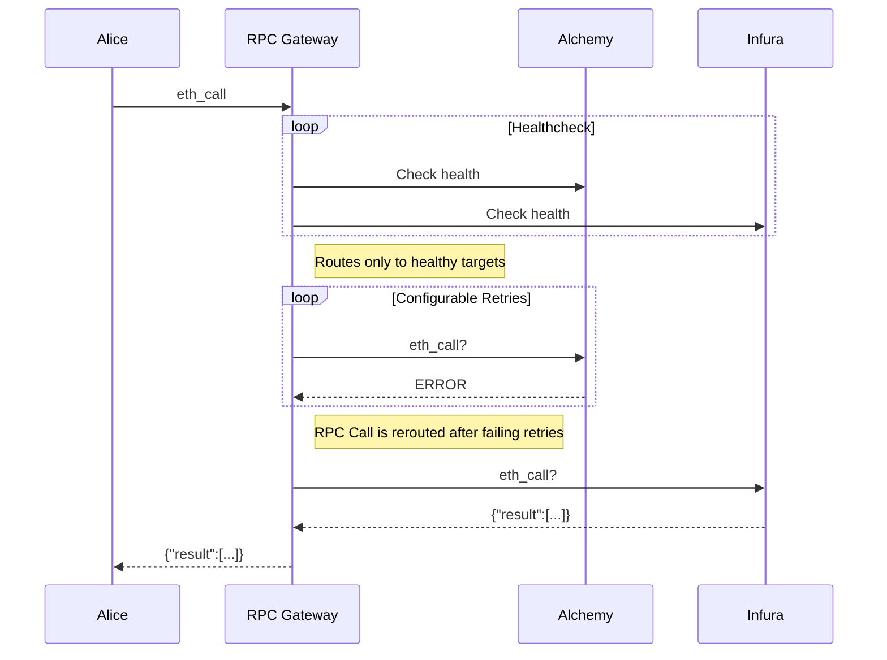

# RPC Gateway

The rpc-gateway is a failover proxy designed for node providers. It ensures high availability and reliability by automatically rerouting requests to a backup node provider when health checks indicate the primary provider is down. This process ensures uninterrupted service even in the event of node provider failures.

## Caution

> :warning: The rpc-gateway is currently in development mode. It is not considered stable and should be used with caution in production environments.

## Overview

The rpc-gateway operates by continuously performing health checks on configured node providers. If the primary node provider fails these checks, the gateway will automatically attempt to route requests to the next available provider based on a predefined failover sequence.



## Development

To contribute to the development of rpc-gateway, ensure that you have Go installed and the project set up locally. Start by running tests to ensure everything is working as expected.

```console
go test -v ./...
```

For local development and testing, you can run the application with:

```console
DEBUG=true go run . --config config.yml
```

Additionally, to load configuration from an environment variables, use the `--env` flag. Ensure the `GATEWAY_CONFIG` environment variable is set with the main configuration data.

```console
DEBUG=true go run . --env
```

## Configuration

The main YAML configuration (`config.yml`) specifies the metrics server port and multiple gateways, each with its own `.yml` configuration file:

```yaml
metrics:
  port: 9090 # Port for Prometheus metrics, served on /metrics and /

gateways:
  - config-file: "config_holesky.yml"
    name: "Holesky gateway"
  - config-file: "config_sepolia.yml"
    name: "Sepolia gateway"
```

Each `.yml` configuration file for the gateways can specify detailed settings for proxy behavior, health checks, and target node providers. Here is an example of what these individual gateway configuration files might contain:

```yaml
proxy:
  port: "3000" # Port for RPC gateway
  upstreamTimeout: "1s" # When is a request considered timed out

healthChecks:
  interval: "5s" # How often to perform health checks
  timeout: "1s" # Timeout duration for health checks
  failureThreshold: 2 # Failed checks until a target is marked unhealthy
  successThreshold: 1 # Successes required to mark a target healthy again

targets: # Failover order is determined by the list order
  - name: "Cloudflare"
    connection:
      http:
        url: "https://cloudflare-eth.com"
  - name: "Alchemy"
    connection:
      http:
        url: "https://alchemy.com/rpc/<apikey>"
```

This configuration can be loaded from a file path, URL, or directly from an environment variable using the `--env` flag.
