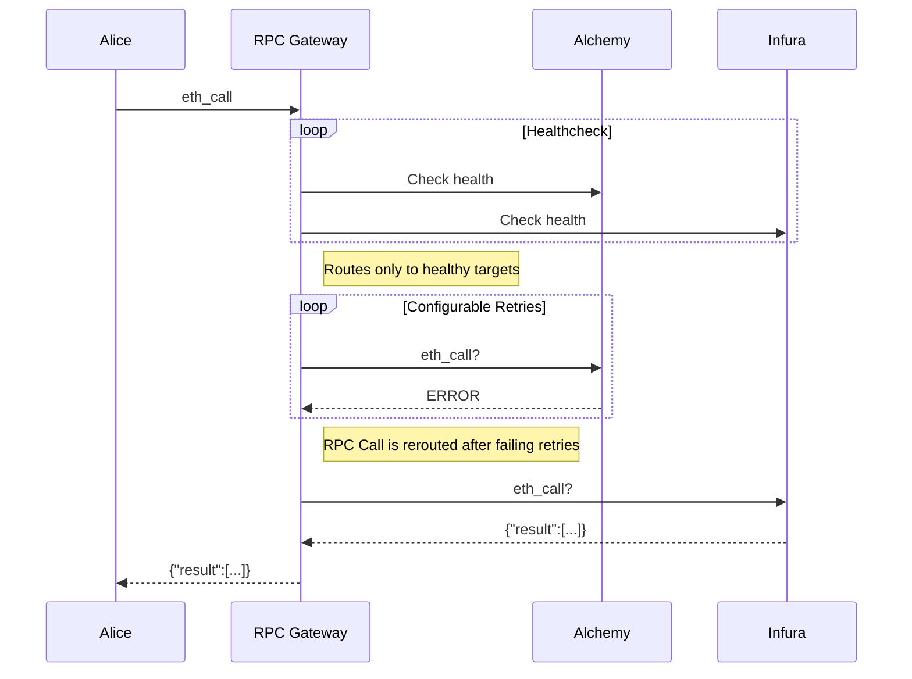

# RPC Gateway

The rpc-gateway is a failover proxy designed for node providers. It ensures high availability and reliability by automatically rerouting requests to a backup node provider when health checks indicate the primary provider is down. This process ensures uninterrupted service even in the event of node provider failures.

## Caution

> :warning: The rpc-gateway is currently in development mode. It is not considered stable and should be used with caution in production environments.

## Overview

The rpc-gateway operates by continuously performing health checks on configured node providers. If the primary node provider fails these checks, the gateway will automatically attempt to route requests to the next available provider based on a predefined failover sequence.



## Development

To contribute to the development of rpc-gateway, ensure that you have Go installed and the project set up locally. Start by running tests to ensure everything is working as expected.

```console
go test -v ./...
```

For local development and testing, you can run the application with:

```console
DEBUG=true go run . --config config.json
```

Additionally, to load configuration from an environment variable, use the `--env` flag. Ensure the `GATEWAY_CONFIG` environment variable is set with the main configuration data.

```console
DEBUG=true go run . --env
```

## Configuration

The main configuration has been updated to use JSON format (`config.json`). It specifies the metrics server port and multiple gateways, each with its own JSON configuration file:

```json
{
  "metrics": {
    "port": 9090
  },
  "port": 4000,
  "gateways": [
    {
      "configFile": "config_holesky.json",
      "name": "Holesky gateway"
    },
    {
      "configFile": "config_sepolia.json",
      "name": "Sepolia gateway"
    }
  ]
}
```

Each JSON configuration file for the gateways can specify detailed settings for proxy behavior, health checks, and target node providers. Here is an example of what these individual gateway configuration files might contain:

```json
{
  "proxy": {
    "port": "3000",
    "upstreamTimeout": "1s"
  },
  "healthChecks": {
    "interval": "5s",
    "timeout": "1s",
    "failureThreshold": 2,
    "successThreshold": 1
  },
  "targets": [
    {
      "name": "Cloudflare",
      "connection": {
        "http": {
          "url": "https://cloudflare-eth.com"
        }
      }
    },
    {
      "name": "Alchemy",
      "connection": {
        "http": {
          "url": "https://alchemy.com/rpc/<apikey>"
        }
      }
    }
  ]
}
```

## Authentication

Authentication can be enabled using the `--auth` flag. The authentication system uses a token-based approach with rate limiting.

### Token Configuration

The token configuration should be provided through the `GATEWAY_TOKEN_MAP` environment variable. This variable should contain a JSON string representing a map of tokens to their corresponding information. Each token entry includes a name and the number of requests allowed per second.

Example of `GATEWAY_TOKEN_MAP`:

```json
{
  "token1": {"name": "User1", "numOfRequestPerSec": 10},
  "token2": {"name": "User2", "numOfRequestPerSec": 20}
}
```

### URL Format

When authentication is enabled, the auth token needs to be the last entry in the RPC gateway URL. 

Example:

`https://sample/rpc-gateway/sepolia/token1`

In this example, `token1` is the authentication token that must match one of the tokens defined in the `GATEWAY_TOKEN_MAP`.

### Rate Limiting

Each token has its own rate limit, defined by the `numOfRequestPerSec` value in the token configuration. If a client exceeds this limit, they will receive a 429 (Too Many Requests) status code.

### Running the Application with Authentication

To run the application with authentication:

```bash
export GATEWAY_TOKEN_MAP='{"token1":{"name":"User1","numOfRequestPerSec":10},"token2":{"name":"User2","numOfRequestPerSec":20}}'
DEBUG=true go run . --config config.json --auth
